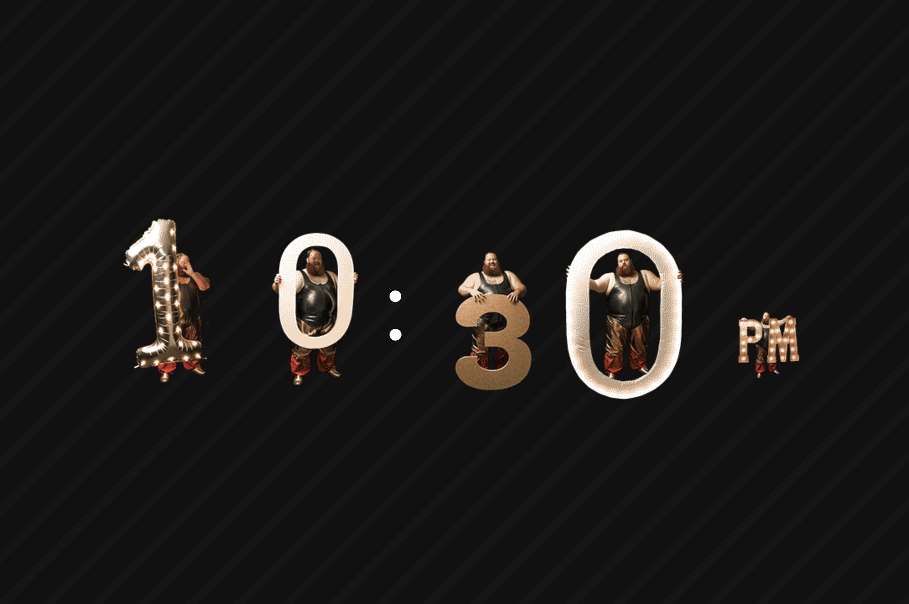

# Human Clock

a little experiment using animated loops to create a clock.

Starting with a still image of a single person, I used midjourney to create variations of
a man holding up numbers. All using the same start and end frame, so they could be swapped
in and out, yet still remain seamless when played together.

Take those videos into photoshop and reduce the frames as well as clean up to remove the background
and save as animated gifs. Those gifs were then used to create a sprite sheet of 121 frames 5 
columns wide.

Using TypeScript I then used the css property of `background-position` to animate them 
programtically, as well as pre-loading the next sprite sheet that will be played. There is some
other logic for interm animations between number changes. The clock is crude, mostly built around 
one SpriteAnimator class that can be used for various counting/numeric display applications. 

